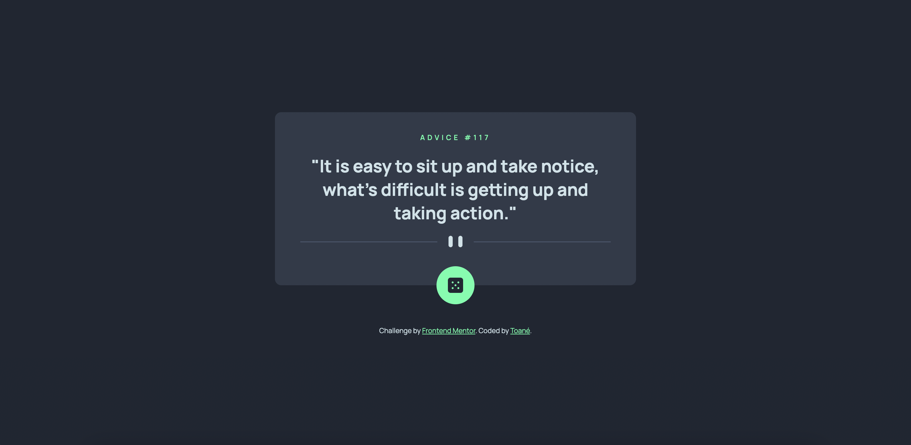

# Frontend Mentor - Advice generator app solution

This is a solution to the [Advice generator app challenge on Frontend Mentor](https://www.frontendmentor.io/challenges/advice-generator-app-QdUG-13db). Frontend Mentor challenges help you improve your coding skills by building realistic projects.

## Table of contents

- [Overview](#overview)
  - [The challenge](#the-challenge)
  - [Screenshot](#screenshot)
  - [Links](#links)
- [My process](#my-process)
  - [Built with](#built-with)
  - [What I learned](#what-i-learned)
  - [Continued development](#continued-development)
  - [Useful resources](#useful-resources)
- [Author](#author)

## Overview

### The challenge

Users should be able to:

- View the optimal layout for the app depending on their device's screen size
- See hover states for all interactive elements on the page
- Generate a new piece of advice by clicking the dice icon

### Screenshot

### Links

- Solution URL: [https://www.frontendmentor.io/solutions/advice-generator-app-using-fetch-api-gZjMyHoDU5](https://www.frontendmentor.io/solutions/advice-generator-app-using-fetch-api-gZjMyHoDU5)
- Live Site URL: [https://coder-txane.github.io/advice-generator-app-main/](https://coder-txane.github.io/advice-generator-app-main/)

## My process

### Built with

- Semantic HTML5 markup
- CSS custom properties
- Flexbox
- CSS Grid
- Mobile-first workflow
- SASS
- JavaScript
- Fetch API

### What I learned

This was my first time working with fetch API in a project. While it took me a while to figure out how to do it, I finally found a solution through a YouTube video that helped me fetch data from the API. I realise that I need to practise working with APIs more.

This was also my first time using SASS. I found it pretty straightforward to use and much more efficient than vanilla CSS. I hope to use it from now on in future projects as it truly streamlined my process of styling the design!

### Continued development

The areas I intend to improve on are:
- SASS
- Fetch API
- Async JavaScript
- Try and Catch

### Useful resources

- [Oston Code Cypher's tutorial on using Advice Slip JSON API](https://www.youtube.com/watch?v=2AfzKmgqWUE&ab_channel=OstonCodeCypher) - This YouTube video helped me figure out how exactly to extract data from the API and implement it.

## Author

- Frontend Mentor - [@yourusername](https://www.frontendmentor.io/profile/coder-txane)
